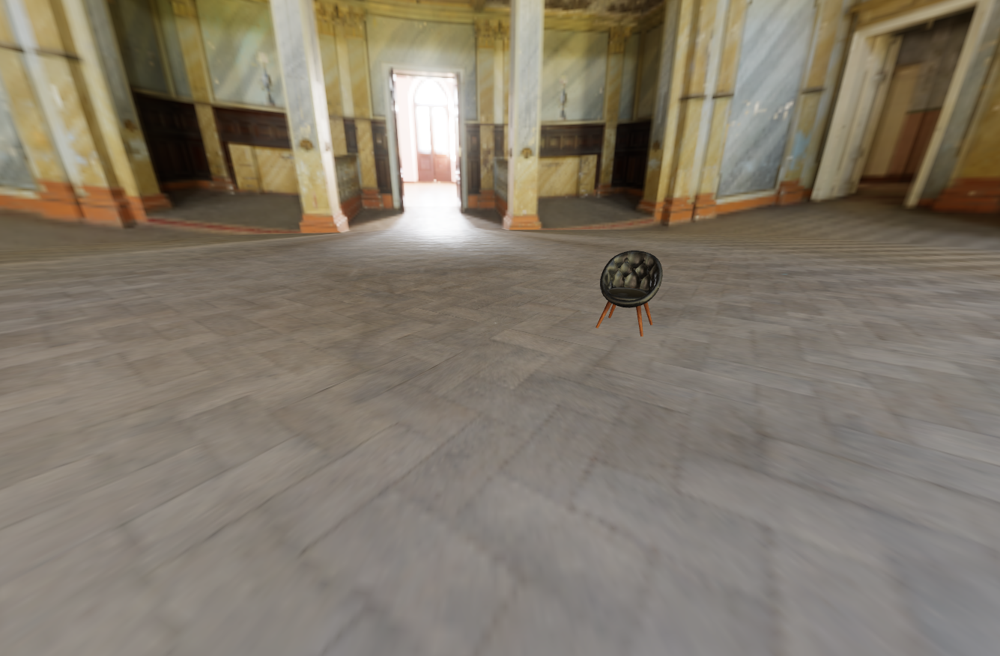
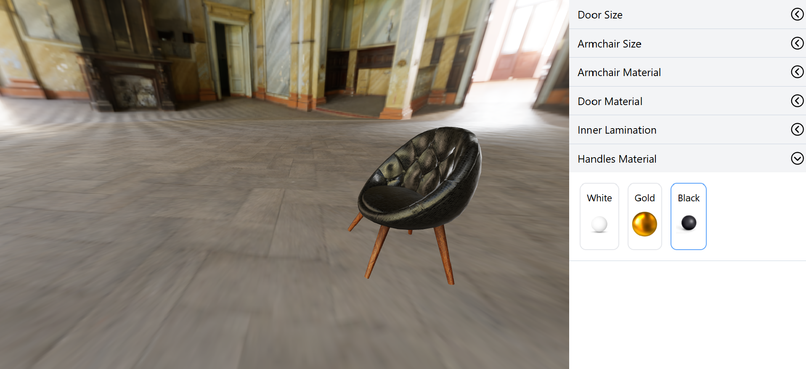

# 3D Furniture Configurator

A web application for designing and visualizing furniture in 3D, built with React, React Three Fiber, and React Context API.

## Features

- **3D Visualization**: Interactively view and manipulate furniture.
- **Real-time Updates**: Instant rendering of changes.
- **Customizable Options**: Choose different furniture types, colors, and materials.

## Technologies Used

- **React**
- **React Three Fiber**
- **React Context API**

