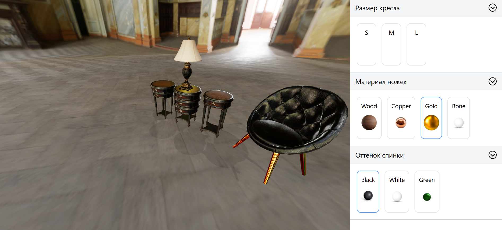
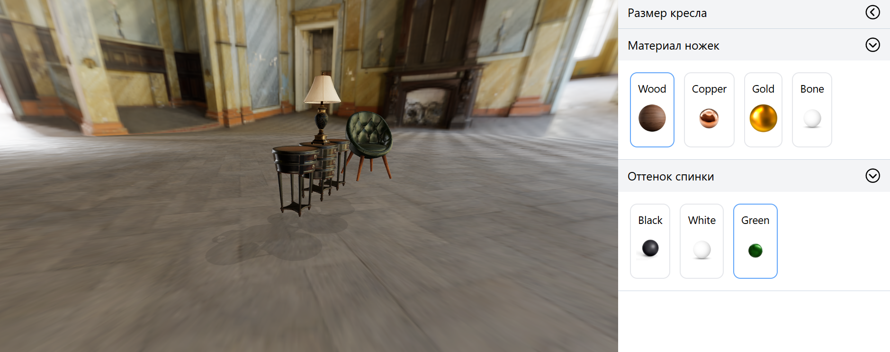

# 3D Vintage-furniture-showroom

A web application for designing and visualizing furniture in 3D, built with React, React Three Fiber, and React Context API.




## Features

- **3D Visualization**: Interactively view and manipulate furniture.
- **Real-time Updates**: Instant rendering of changes.
- **Customizable Options**: Choose different furniture types, colors, and materials.

## Technologies Used

- **React**
- **React Three Fiber**
- **React Context API**

## Project structure

```
src/
  components/
    ui/
      LoadingAlert.jsx
      SelectOptions.jsx
      Slot.jsx
  three/
    Scene.jsx
    environment/
      Environment.jsx
      Lights.jsx
      Controls.jsx
    models/
      Armchair.jsx
      Lamp.jsx
      Table1.jsx
      Table2.jsx
      Table3.jsx
  context/
    Customization.jsx
  hooks/
    useColorMaterial.js
  utils/
    options.js
  assets/
    react.svg
    textureIcon.jpg
  App.jsx
  index.css
  main.jsx
```

## Aliases

Path alias `@` points to `src/` (see `vite.config.js`). Example:

```js
import Environment from '@/three/environment/Environment';
```

## Development

```
npm i
npm run dev
```

## Lint & format

```
npm run lint
npm run lint:fix
npm run format
npm run format:check
```

## Assets

- Keep original assets in `public/`. Build artifacts in `dist/` are git-ignored.
- Prefer optimized GLB (Draco) and KTX2 textures. Keep HDR/EXR sizes modest (1k/2k).

## Анализ бандла

```
npm run analyze
npm run analyze:serve
```

## Состояние (Zustand)

- Стор находится в `src/state/customizationStore.js`.
- Хук импорта:

```js
import { useCustomization } from '@/state/customizationStore';
```
